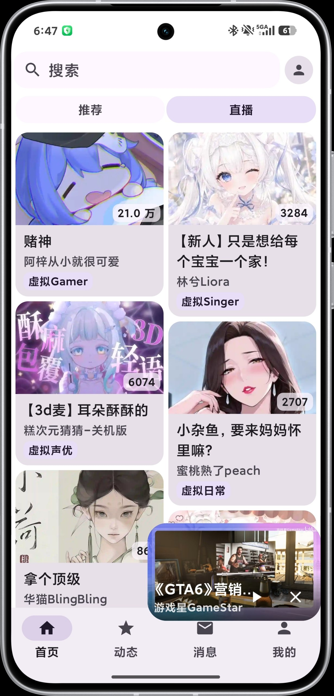
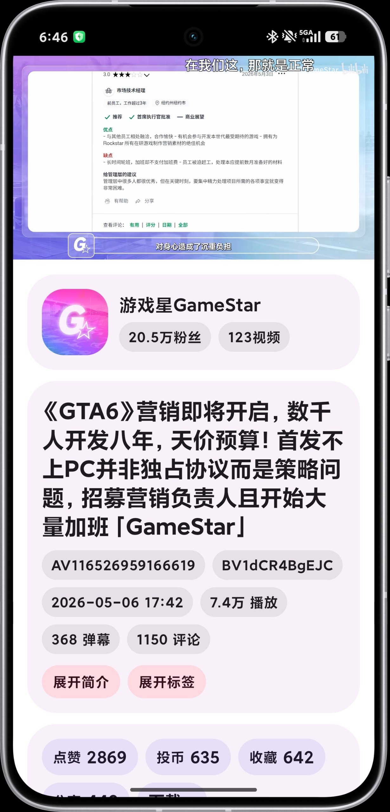
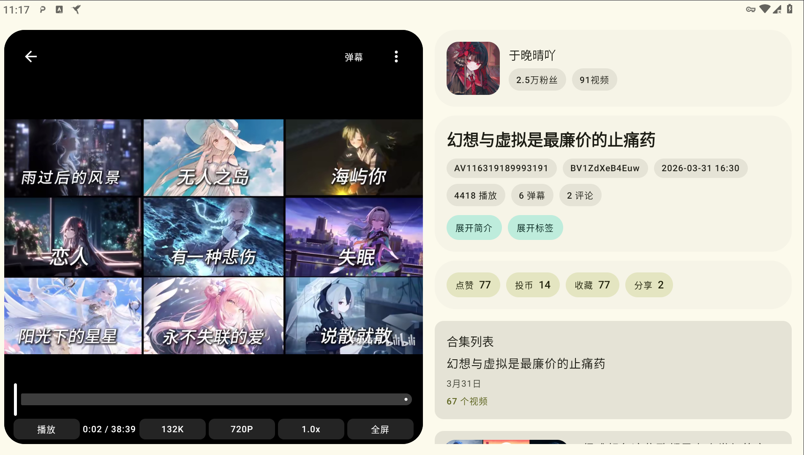

  

  
  
  
  

  一个使用 Jetpack Compose 和 Material 3 构建的第三方 B 站 Android 客户端。

## 下载

前往 [Releases](https://github.com/naaammme/bbspace/releases) 页面获取最新安装包。

## 已实现功能

- 扫码登录和短信登录
- 首页推荐视频流
- 视频播放
- 多账号管理
- 设置
- 视频搜索
- 视频详情页
- 弹幕
- 直播
- 评论区
- 其他基础能力持续补全中

## 开发计划

- [ ] 字幕
- [ ] 直播
- [ ] 个人空间
- [ ] 分类搜索
- [ ] 评论
- [ ] 收藏和历史记录
- [ ] 动态
- [ ] 其他功能完善

## 截图

  
  

  

## 说明

项目主要用于学习、研究和界面实现练习。仓库内涉及的接口信息均来自公开资料整理，仅用于技术交流，不包含破解和付费内容分发。

## 致谢

- [bilibili-API-collect](https://github.com/SocialSisterYi/bilibili-API-collect) 分享的 api 接口
- [PiliPlus](https://github.com/bggRGjQaUbCoE/PiliPlus) 提供部分功能的思路
- [media3](https://github.com/androidx/media) 提供视频解码播放能力
- [DanmakuFlameMaster](https://github.com/naaammme/DanmakuFlameMaster) 提供弹幕渲染能力
- ... 
- 等等

## License

[GPL-3.0](LICENSE)
