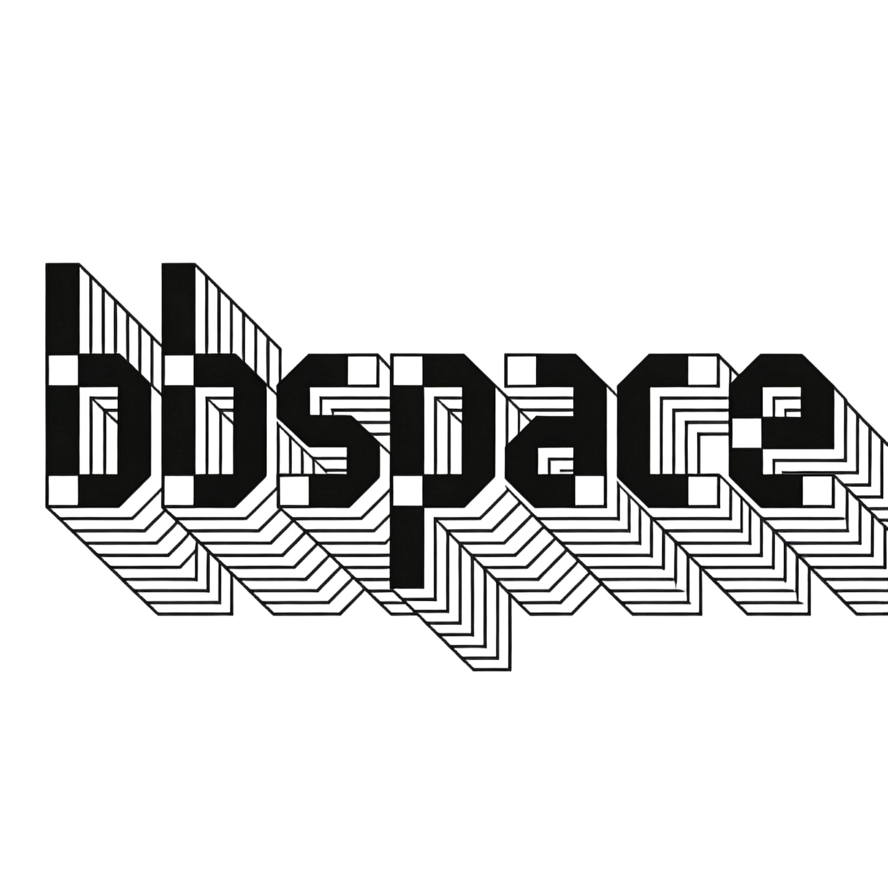
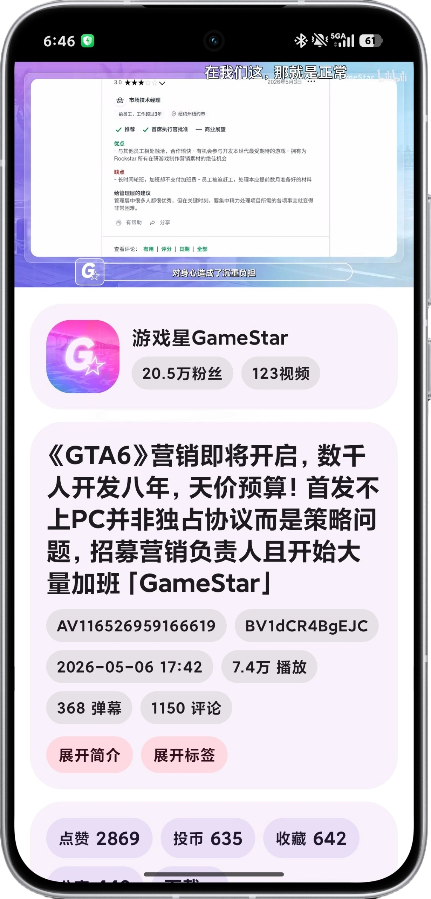

# bbspace

  
  
  
  

一个使用 Jetpack Compose + Material3 开发的第三方 B 站 Android 客户端。

## 下载
点击[release](https://github.com/naaammme/bbspace/releases)下载

## 已实现功能

- 扫码登录 / 短信登录
- 首页推荐视频流
- 视频播放
- 多账户管理
- 设置
- 其他

## 待实现

- [ ] 视频详情页
- [ ] 视频弹幕字幕
- [ ] 直播
- [ ] 个人空间
- [ ] 搜索
- [ ] 评论区
- [ ] 收藏 / 历史记录
- [ ] 动态
- [ ] 其他

## 截图

  
  

## 声明
此项目是个人为了兴趣而开发，仅用于学习和测试，所用 API 皆从官方网站收集，不包含任何破解和付费内容。

## License

[GPL-3.0](LICENSE)
